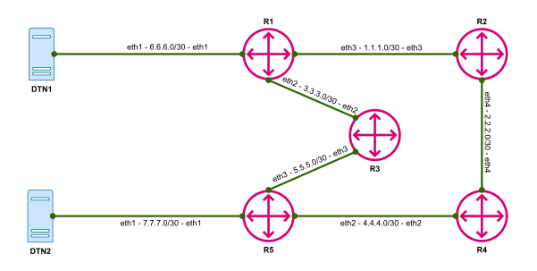

# TCC2022
PolKA protocol experiment using emulated RARE/freeRtr.

## Title
How to prototype and implement a testbed using whiteboxes and RARE/freeRtr?

## Requirements
* Basic Linux/Unix knowledge
* Service provider networking knowledge

## Prerequisites
* TMUX
* WGET
* default-jre-headless

## Topology

## Launch the Topology

## Experiment

## References
